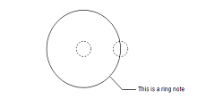
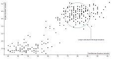

# d3.ringNote

D3 plugin for creating and positioning circle and text annotation. Useful for 
commenting on an area of a graphic or map.

Inspired by the [swoopyDrag](http://1wheel.github.io/swoopy-drag/) 
plugin and the annotation on maps like
[these](http://www.nytimes.com/interactive/2014/11/04/upshot/senate-maps.html) 
from the New York Times.

### Examples

<table>
  <tr>
    <td>
      Ring Notes<br>
      <a href="http://bl.ocks.org/armollica/67f3cf7bf08a02d95d48dc9f0c91f26c"></a>
    </td>
    <td>
      Map Annotation<br>
      <a href="http://bl.ocks.org/armollica/70afe1b4265425cb6e031b973e6d9811"></a>
    </td>
    <td>
      Chart Annotation<br>
      <a href="http://bl.ocks.org/armollica/853c9344a7808619d863c8d7410062e6"></a>
    </td>
  </tr>
</table>

### How To Use
Save the `d3-ring-note.js` file from this repo and include it in your HTML after including D3:
```html
<script src="https://d3js.org/d3.v3.min.js" charset="utf-8"></script>
<script src="d3-ring-note.js"></script>
```

### API Reference

*#* d3.**ringNote**()

Creates a new annotation generator (see below how to use this). 

*#* **ringNote**(*selection*, *annotations*)

Draws the annotation on the selection. The *selection* argument will 
usually be an svg `<g>` node and the *annotations* argument will be an array of 
objects, each a specification for an individual annotation. The 
*annotations* array will look something like this:

```javascript
var annotations = [
  {
    "cx": 40,
    "cy": 100,
    "r": 25,
    "text": "Something important you should know",
    "textWidth": 150,
    "textOffset": [35, 40] 
  },
  ...
];
```

Each annotation's specification has the following properties:
- `cx` - x-coordinate of the circle's center
- `cy` - y-coordinate of the circle's center
- `r` - radius of the circle
- `text` - the text to be displayed
- `textWidth` - the width (in pixels) at which the text should wrap into multi-line text (optional) 
- `textOffset` - array [x, y] defining location of the text relative 
to the circle's center

After you have positioned the annotation, you can open your browser's 
console and run `copy(annotations)`. This will
save the updated annotation data to your clipboard. You
can then paste it into your text editor, overwriting the old 
*annotations* array.

The `copy()` function works in Chrome and Firefox
but not Internet Explorer. For IE you can run `JSON.stringify(annotations)`
and then manually copy the text that gets output using your mouse.

The `ringNote` function returns the original selection which allows for 
method chaining:
```javascript
svg.append("g")
    .attr("class", "annotations")
    .call(ringNote, annotations)
  .selectAll(".annotation circle")
    .style("fill", "none");
``` 
Each annotation is wrapped in a 
`<g class="annotation">...</g>` node, letting you select and style
the annotation's elements (e.g., the `circle`, `path` and `text`). Data from the *annotations* array is bound to this 
node so you can style annotations differently based on data. 

*#* ringNote.**draggable**(*draggable*)

Defines whether the annotation should be draggable, `true` or `false`.
If `true` then you will be able to move the circle's center, adjust the 
radius and move the text's location relative to the center. 

Defaults to
`false` which disables this functionality and removes the draggable
dashed-line circles.